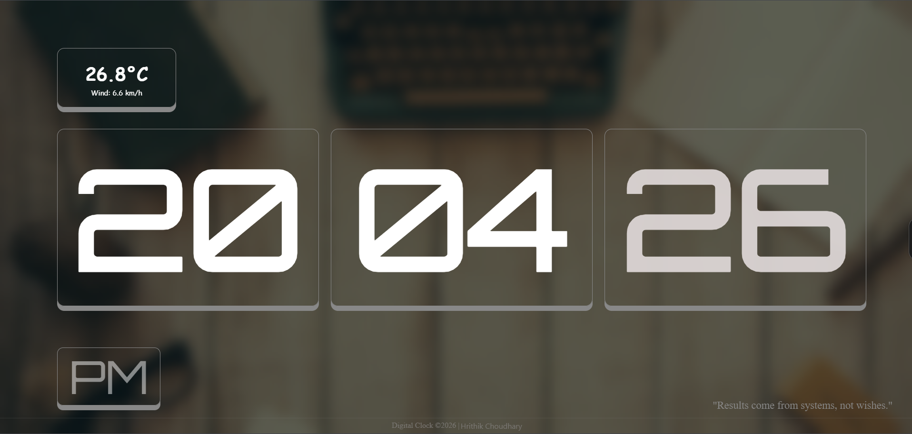

# ⏰ Motivation Clock

Motivation Clock is a simple web project that displays the **current time, motivational quotes, and current weather information** in one place.  
The aim of this project is to keep users motivated while also providing useful information like time and weather.
 
Developer: HRC Developer
---

## 🚀 Features

- **Live Digital Clock** – Shows the current time in real time.
- **Motivational Quotes** – Displays inspiring quotes to keep users motivated.
- **Current Weather** – Shows the current weather of the user's location.
- **Simple User Interface** – Clean and easy-to-use design.

---

## 🛠 Technologies Used

- **HTML**
- **CSS**
- **JavaScript**
- **Weather API** (for live weather updates)

---

## 🎯 Purpose of the Project

The main purpose of this project is to create a **small productivity dashboard** where users can:

- Check the current time  
- Read motivational quotes  
- View current weather conditions  

All in one simple and interactive interface.

---

